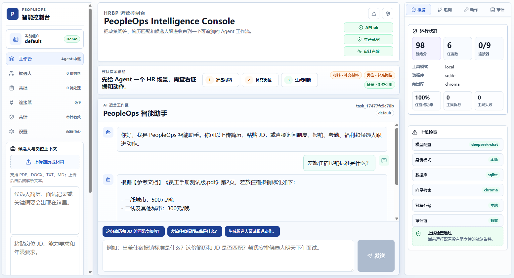
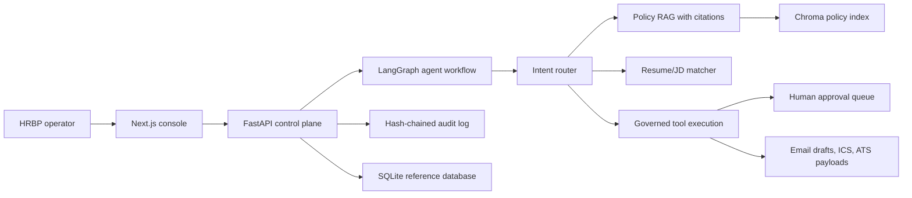

# PeopleOps Intelligence Agent

PeopleOps Intelligence Agent is an AI-native HRBP workbench for policy Q&A, resume/JD matching, candidate follow-up actions, approvals, audit evidence, and local ATS-style records. It is designed as a practical enterprise-console reference project rather than a single-purpose RAG demo.

[](https://github.com/dafu110/peopleops-intelligence-agent/actions/workflows/ci.yml)

It demonstrates a production-shaped AI agent loop for PeopleOps teams: collect HR context, route the request, retrieve grounded policy evidence, run governed candidate actions, and leave auditable traces for review.

## Portfolio Highlights

- **Real operator console**: Next.js workspace with intake, Agent chat, evidence, approvals, audit status, and readiness checks in one screen.
- **Grounded HR policy RAG**: Chinese policy handbook retrieval with citations, Chroma persistence, manifest invalidation, and CI quality gates.
- **Agent workflow beyond chat**: LangGraph routing across policy Q&A, resume/JD matching, and governed tool execution.
- **Enterprise controls**: tenant headers, RBAC, access-password mode, PII redaction, approval gates, API rate limits, and hash-chained audit events.
- **Deployment path**: Docker Compose assets plus PostgreSQL, Qdrant, object storage, SSO/OIDC, and connector readiness checks for production handoff.

## Reading Guide

Start here if you are reviewing the project for the first time:

1. **Product Snapshot**: what the app does and what the UI looks like.
2. **Quick Start**: how to run the professional web console and API locally.
3. **Closed-Loop Experience**: how the operator flow works end to end.
4. **Core Capabilities**: which agent, RAG, governance, and persistence pieces are included.
5. **Architecture, API, and Configuration**: implementation and deployment details.

## Product Snapshot

The primary product surface is now a Next.js web console backed by the FastAPI control plane. It uses a professional three-panel workbench: context intake on the left, a single Agent conversation workspace in the center, and evidence, approvals, runtime state, and audit signals on the right.

The screenshot below is a live run of the Next.js web console. The Streamlit workbench remains available only as an optional local demo/debug surface.

```text
Assemble context -> Agent judgment -> Execute action -> Governance evidence
```



## 60-Second Demo Flow

Use this path when reviewing the project for the first time:

1. Upload `data/测试简历.pdf` or paste resume text into the candidate context panel.
2. Paste the JD from `data/职位描述.pdf`.
3. Ask: `这份简历和 JD 的匹配度如何？`
4. Ask: `差旅住宿报销标准是什么？`
5. Ask: `生成候选人面试跟进动作。`
6. Review the right-side evidence, task trace, approval/action records, and audit status.

Full walkthrough: [`docs/demo-flow.md`](docs/demo-flow.md).

## Quick Start

Create the local configuration once. Keep `.env` out of source control and replace the sample model values before sending real Agent requests:

```powershell
if (-not (Test-Path .env)) { Copy-Item .env.example .env }
```

### Windows: FastAPI + Next.js

Run the FastAPI backend in one PowerShell window. The commands call the virtual environment's Python directly, so PowerShell execution policy does not need to allow `Activate.ps1`:

```powershell
cd backend
python -m venv .venv
.\.venv\Scripts\python.exe -m pip install -r requirements.txt
.\.venv\Scripts\python.exe -m uvicorn api:app --host 127.0.0.1 --port 8000
```

Run the professional frontend in a second PowerShell window:

```powershell
cd frontend
pnpm install
pnpm dev
```

If `pnpm` is unavailable or Corepack cannot write to a protected Node installation, use the package-manager fallback instead:

```powershell
cd frontend
npx.cmd pnpm@11.7.0 install
npx.cmd pnpm@11.7.0 dev
```

Open `http://127.0.0.1:3000`.

Confirm the backend first at `http://127.0.0.1:8000/health`. If the console shows `Failed to fetch`, ensure the backend window is still running before refreshing the page.

### Docker: local full stack

With Docker Desktop running and `.env` configured, this starts the local API and web console without installing Python or pnpm locally:

```powershell
docker compose -f infra/docker-compose.yml up --build
```

The local Compose profile uses SQLite, Chroma, and local artifacts for demonstration. The production-oriented Compose file remains a separate deployment configuration and requires its documented identity, database, storage, and tenant settings.

The Streamlit demo can still be started from the backend folder with:

```powershell
cd backend
python -m streamlit run app.py
```

On Windows, if dependency installation fails while unpacking `torch` because the repository path is too deep, use the short-path setup in [`docs/clean-install-and-test.md`](docs/clean-install-and-test.md).

## Closed-Loop Experience

The app is organized around the daily flow of an HR operator.

- **Assemble context**: upload candidate resumes, paste the JD, preview extracted resume text, and check runtime readiness.
- **Agent judgment**: route questions to policy RAG, resume/JD matching, or action tools through the LangGraph workflow from one primary input.
- **Execute action**: create local candidate follow-up actions, email drafts, calendar artifacts, approval requests, and ATS sync payloads.
- **Governance evidence**: review recent actions, pending approvals, audit events, connector readiness, and audit-chain integrity.

The product UI intentionally avoids duplicate search boxes: evidence retrieval is shown as part of the Agent workflow rather than exposed as a second manual query path.

## Core Capabilities

- AI agent workflow in `backend/core/workflow.py` with intent routing for RAG, resume analysis, and tool execution.
- Enterprise policy retrieval in `backend/core/rag_engine.py` with persistent Chroma indexing and page-aware citations.
- Resume/JD matching in `backend/core/matcher.py` with structured fit analysis output.
- Local tool execution in `backend/core/tools.py` for candidate follow-up scheduling, email drafts, calendar `.ics` files, ATS exports, and approval gates.
- SQLite persistence in `backend/core/database.py` for users, action records, approval requests, tenant scope, and RAG eval metrics.
- Security and governance foundations: access password support, roles, tenant headers, PII redaction, hash-chained audit logs, and audit integrity checks.
- FastAPI control plane in `backend/api.py` for health, readiness, identity, chat, action records, approvals, connectors, and audit endpoints.
- Deployment assets: `infra/Dockerfile`, `infra/docker-compose.yml`, `.devcontainer`, and deployment notes under `docs/`.

## Quality Signals

- GitHub Actions runs backend compile checks, unit tests, RAG dataset validation, RAG fixture scoring, frontend install/build, and real retriever evaluation.
- Agent golden traces cover RAG routing, resume screening, missing-context handling, scheduling, and candidate-stage tool flows.
- RAG evals require 100% pass rate in CI with keyword coverage, citation correctness, PII leakage, and forbidden-term checks.
- Production readiness docs cover identity, managed state, object storage, connector configuration, eval reports, and rollback signals.
- Public hygiene checks block tracked secrets, generated runtime state, stale README screenshots, mojibake markers, invalid JSONL fixtures, and broken local Markdown links.

## Architecture



```text
Next.js Web Console / Streamlit Demo / FastAPI
        |
LangGraph workflow
  |-- intent router
  |-- policy RAG node
  |-- resume matcher node
  `-- tool execution node
        |
Engineering services
  |-- SQLite app database
  |-- persistent Chroma index + manifest invalidation
  |-- hash-chained audit JSONL
  |-- PII redaction
  |-- local ATS records
  |-- email draft artifacts
  `-- calendar ICS artifacts
```

## API Backend

```powershell
cd backend
python -m uvicorn api:app --host 0.0.0.0 --port 8000
```

Useful endpoints:

- `GET /health`
- `GET /readiness`
- `GET /me`
- `POST /chat`
- `GET /interviews`
- `GET /approvals`
- `GET /connectors`
- `GET /audit/events`
- `GET /audit/integrity`

When `ACCESS_PASSWORD` is configured, pass `X-Access-Password`.
For multi-tenant API calls, pass `X-Tenant-ID`, `X-Org-ID`, and `X-Department-ID`; local defaults are used when these headers are absent.
When `REQUIRE_ACCESS_PASSWORD=true`, the API refuses authenticated operations until `ACCESS_PASSWORD` is configured.

## Project Map

| Path | Purpose |
| --- | --- |
| `frontend/` | Next.js professional Agent console for context intake, chat, evidence, approvals, and audit status. |
| `backend/app.py` | Streamlit workbench and local debug UI. |
| `backend/api.py` | FastAPI control plane for chat, identity, readiness, action records, approvals, connectors, and audit data. |
| `backend/core/` | Agent workflow, RAG, matcher, security, audit, tenancy, database, connectors, and tool execution modules. |
| `data/` | Sample HR policy, resume, and JD documents used by the demo. |
| `docs/` | Deployment notes, clean-install notes, AI coding workflow notes, and product screenshots. |
| `docs/project/` | Archived project planning notes and delivery context. |
| `evals/` | RAG evaluation dataset. |
| `infra/` | Dockerfile and Docker Compose deployment assets. |
| `var/` | Local runtime state such as SQLite, audit logs, generated artifacts, and Chroma indexes. |
| `backend/scripts/` | Utility scripts for password hashing and RAG evaluation. |
| `backend/tests/` | Unit tests for core behavior, API control plane, security, tenancy, and evaluation helpers. |
| `AGENTS.md` | Agent operating guide, required checks, public repo rules, and review priorities. |

Production gate details are tracked in [`docs/operations-readiness-gates.md`](docs/operations-readiness-gates.md), including external connector proof, object storage checks, migration expectations, monitoring alerts, and release-drill evidence.

## Demo vs Production Boundary

This repository is intentionally clear about what is implemented locally and what must be configured for a live enterprise deployment.

| Area | Local reference implementation | Production expectation |
| --- | --- | --- |
| Identity | Optional access password, roles, tenant headers, local defaults | SSO or OIDC with real bearer-token validation and gateway policy |
| Database | SQLite runtime database | PostgreSQL with migrations, backups, and tenant-aware operational controls |
| Vector search | Chroma policy index on local disk | Qdrant, pgvector, Milvus, or managed retrieval service with persistence and monitoring |
| Files/artifacts | Local email drafts, calendar files, ATS export payloads | Object storage plus live connector probes and retention policies |
| Tool actions | `dry_run`, `approval`, or local artifact creation | `approval` before live mode; compensation and rollback evidence required |
| Observability | Readiness endpoint, audit hash chain, local tests/evals | Centralized logs, metrics, alerts, error budgets, and release-drill evidence |

## Configuration

| Variable | Default | Purpose |
| --- | --- | --- |
| `APP_NAME` | `PeopleOps Intelligence Agent` | Product name |
| `OPENAI_API_KEY` | empty | Model API key |
| `OPENAI_API_BASE` | empty | OpenAI-compatible base URL |
| `OPENAI_MODEL` | `deepseek-chat` | Chat model |
| `EMBEDDING_MODEL` | `BAAI/bge-small-zh-v1.5` | Chinese-friendly embedding model |
| `HR_POLICY_PDF` | `data/员工手册测试版.pdf` | Policy knowledge base used by the local RAG demo. |
| `CHROMA_PERSIST_DIR` | `var/chroma/policy` | Persistent vector index |
| `RAG_MANIFEST_PATH` | `var/chroma/policy/manifest.json` | RAG index manifest |
| `RAG_CHUNK_SIZE` | `400` | RAG chunk size |
| `RAG_CHUNK_OVERLAP` | `40` | RAG chunk overlap |
| `RAG_TOP_K` | `3` | Retrieved chunks per question |
| `ENTERPRISE_MODE` | `false` | Enables stricter production-readiness warnings |
| `REQUIRE_ACCESS_PASSWORD` | `false` | Requires `ACCESS_PASSWORD` for API access |
| `ACCESS_PASSWORD` | empty | Optional access password |
| `ACCESS_PASSWORD_MIN_LENGTH` | `12` | Minimum plain-text password length warning threshold |
| `APP_DB_PATH` | `var/runtime/peopleops.sqlite3` | SQLite app database |
| `AUDIT_LOG_PATH` | `var/runtime/audit/events.jsonl` | JSONL audit log |
| `AUDIT_LOG_MAX_BYTES` | `5000000` | Audit log rotation threshold |
| `AUDIT_HASH_CHAIN_ENABLED` | `true` | Adds `previous_event_hash` and `event_hash` to audit records |
| `API_RATE_LIMIT_PER_MINUTE` | `120` | Per-client in-memory API rate limit; use gateway limits in production |
| `DEFAULT_TENANT_ID` | `default` | Local fallback tenant scope |
| `DEFAULT_ORG_ID` | `default-org` | Local fallback organization scope |
| `DEFAULT_DEPARTMENT_ID` | `peopleops` | Local fallback department scope |
| `DATABASE_BACKEND` | `sqlite` | Reference backend marker; use `postgresql` in production |
| `VECTOR_BACKEND` | `chroma` | Reference vector backend marker; use pgvector, Qdrant, Milvus, or managed search in production |
| `OBJECT_STORAGE_URI` | empty | S3, MinIO, OSS, or managed object storage URI for production files |
| `APPROVAL_REQUIRED_ACTIONS` | `send_email,calendar_invite,ats_stage_change,offer_draft,rejection_draft` | Tool actions that require human confirmation |
| `CONFIGURED_CONNECTOR_ENV` | empty | Comma-separated connector env vars present in this deployment |
| `EMAIL_DRAFT_DIR` | `var/runtime/email_drafts` | Generated `.eml` drafts |
| `CALENDAR_DIR` | `var/runtime/calendar` | Generated `.ics` files |
| `ATS_EXPORT_DIR` | `var/runtime/ats_exports` | Local ATS sync payloads |
| `TOOL_EXECUTION_MODE` | `local` | `dry_run`, `approval`, `local`, or `live` |
| `SMTP_HOST` | empty | SMTP host used only in `live` tool mode |
| `SMTP_PORT` | `587` | SMTP port |
| `SMTP_FROM` | `hr@example.com` | Sender for generated follow-up email |

## Enterprise Controls

- Set `ENTERPRISE_MODE=true` and `REQUIRE_ACCESS_PASSWORD=true` before exposing the API beyond a local demo.
- Store `ACCESS_PASSWORD` as `pbkdf2_sha256$...`; plain text and legacy `sha256:` values are accepted for compatibility but reported in readiness warnings.
- Generate a password hash with `python backend/scripts/hash_password.py`, then paste the output into `.env` as `ACCESS_PASSWORD`.
- Use `TOOL_EXECUTION_MODE=approval` when candidate follow-up actions should create an auditable pending action instead of immediately generating email, calendar, or ATS artifacts.
- Use `X-Tenant-ID`, `X-Org-ID`, and `X-Department-ID` on API calls to isolate action records, approvals, audit context, and downstream ATS payloads.
- Review `/approvals` before executing follow-up messages, rejection drafts, offer drafts, calendar invites, or ATS stage changes.
- Review `/connectors` to see which enterprise HRIS, ATS, collaboration, mail, and calendar integrations are configured or still planned.
- Use `/audit/events` for recent audit inspection; each record includes a request ID and a hash-chain pointer to make accidental tampering visible.
- Use `/audit/integrity` to verify the audit hash chain before exporting evidence or closing an incident review.
- Treat SQLite, local files, and local Chroma as a reference implementation. For production, move state to PostgreSQL, object storage, and a managed vector/search service with tenant isolation.

## Docker

```powershell
docker compose -f infra/docker-compose.yml up --build
```

Open the web console at `http://127.0.0.1:3000`; the FastAPI control plane is exposed at `http://127.0.0.1:8000`.

## Launch Readiness

- [Launch hardening checklist](docs/launch-hardening.md)
- [ADR: Governed PeopleOps tool execution](docs/adr/0001-governed-peopleops-tools.md)
- [ADR: Public repository quality gates](docs/adr/0002-public-quality-gates.md)
- [ADR: Candidate assistance decision boundary](docs/adr/0003-candidate-decision-support-boundary.md)
- [Agent specification](docs/agent-spec.md)
- [Product evidence package](docs/product-evidence.md)
- [Agent operating guide](AGENTS.md)
