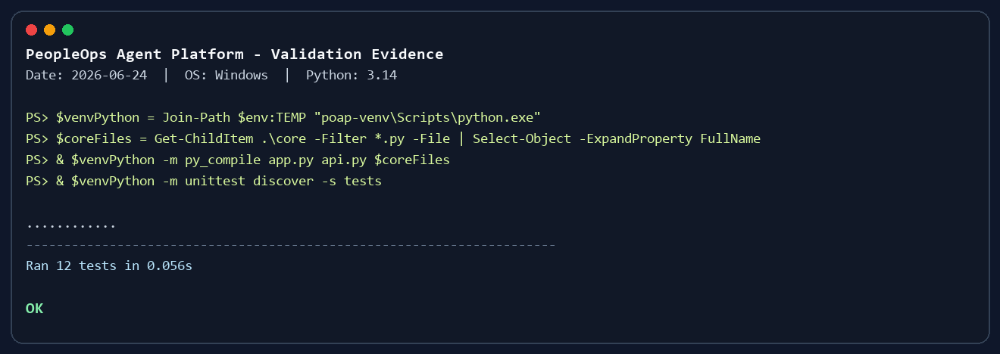

# Clean Install And Test Evidence

This note records a reproducible local validation flow for PeopleOps Intelligence Agent. It is intended for repository QA, handoff review, and fresh-machine setup.

## Environment Used For Validation

- Date: 2026-06-24
- OS: Windows
- Python: 3.14
- Dependency source: `backend/requirements.txt`
- Test command: `python -m unittest discover -s backend/tests`

## Windows Long Path Note

The project depends on `torch`, which can unpack files with very deep internal paths. On Windows, installing the full dependency set inside a deeply nested repository path may fail with a long-path error such as:

```text
OSError: [Errno 2] No such file or directory: ... torch\include\ATen\native\transformers\cuda\...
HINT: This error might have occurred since this system does not have Windows Long Path support enabled.
```

There are two clean options:

1. Enable Windows Long Path support.
2. Create the virtual environment in a short path such as `%TEMP%\poap-venv`.

The validation below uses the second option so the setup works without changing system policy.

## Clean Install

```powershell
$venv = Join-Path $env:TEMP "poap-venv"
if (Test-Path $venv) { Remove-Item -Recurse -Force -LiteralPath $venv }

python -m venv $venv
$venvPython = Join-Path $venv "Scripts\python.exe"

& $venvPython -m pip install --upgrade pip
& $venvPython -m pip install -r backend/requirements.txt
```

For a standard short project path, the usual local project virtual environment also works:

```powershell
python -m venv venv
.\venv\Scripts\Activate.ps1
pip install -r backend/requirements.txt
```

## Validation Commands

```powershell
$venvPython = Join-Path $env:TEMP "poap-venv\Scripts\python.exe"
$coreFiles = Get-ChildItem .\backend\core -Filter *.py -File | Select-Object -ExpandProperty FullName

& $venvPython -m py_compile backend/app.py backend/api.py $coreFiles
$env:PYTHONPATH = Join-Path (Get-Location) "backend"
& $venvPython -m unittest discover -s backend/tests
```

## Test Result

The 2026-06-24 validation run completed successfully:

```text
............
----------------------------------------------------------------------
Ran 12 tests in 0.056s

OK
```



## What The Test Suite Covers

- Intent routing fallback behavior.
- Resume analysis result normalization.
- PII redaction for phone numbers, email addresses, and ID-card-like values.
- Nested payload redaction.
- Plain text document import.
- Interview time parsing for common Chinese time expressions.
- Local tool execution that writes action records, `.eml` drafts, `.ics` calendar artifacts, and ATS export payloads.
- Role-based permission checks.
- FastAPI permission mapping to `403`.
